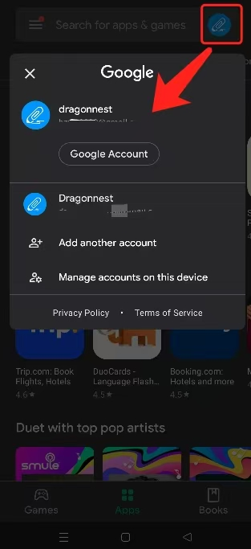

[用户手册](/drawnote/manual/zh) > [常见问题](/drawnote/manual/zh/q_a) >

## **DrawNote Pro gekauft, funktioniert aber nicht?**

Solange Ihr Gerät mit **dem gleichen Google-Konto angemeldet ist, das für den Kauf verwendet wurde**, können Sie die Pro-Funktionen wiederherstellen.

⚠️ **Falls es weiterhin nicht funktioniert, befolgen Sie bitte die folgenden Schritte:**

1. Sichern Sie Ihre Dateien und deinstallieren Sie anschließend die DrawNote-App.

2. Melden Sie sich von **allen Google-Konten** auf dem Gerät ab (einschließlich der Konten im Play Store und im Browser).

3. Melden Sie sich im Play Store mit dem **richtigen Google-Konto** erneut an und installieren Sie DrawNote neu.

4. Öffnen Sie die DrawNote-App und überprüfen Sie den Kaufstatus.

💡 **Tipp:** Sichern Sie Ihre Dateien unbedingt vor der Deinstallation der App, um Datenverlust zu vermeiden.

