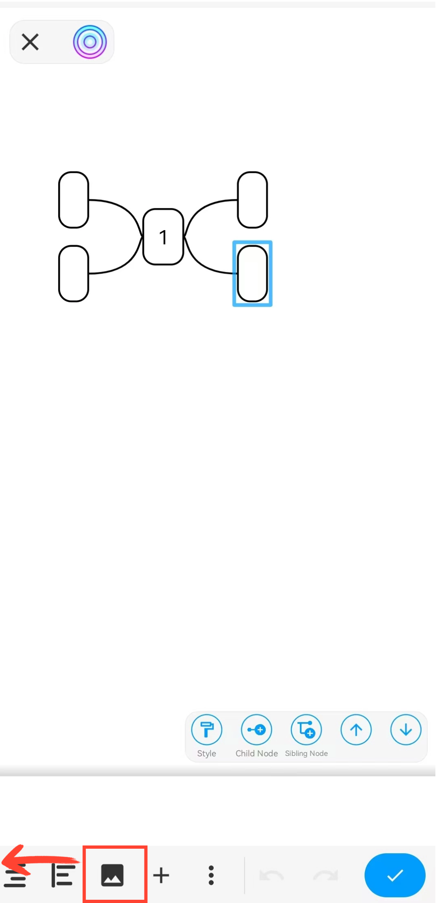

[User Manual](/drawnote/manual/en) > [Mind Mapping](/drawnote/manual/en/mind_mapping) >

## Insert picture

Double-click the node where you want to insert an image. In the toolbar at the bottom of the canvas, swipe left, find and tap the “Image” button, then select an image to insert.

