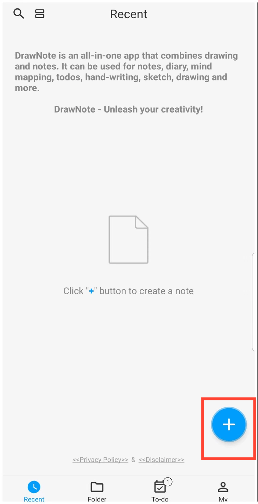
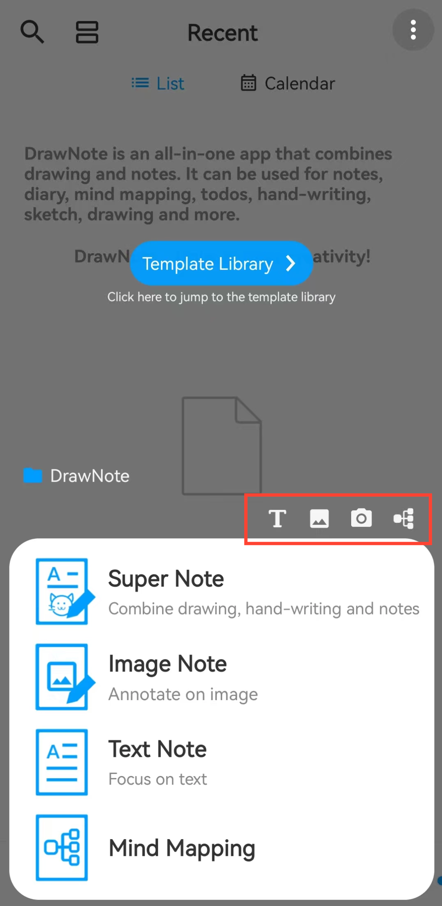

#### Create a New Note

DrawNote provides you with a variety of note types, making creation and recording more free and efficient:

* Super Note - Integrates handwriting, drawing, text, images, audio recording, tables, and mind maps into one. The canvas extends infinitely, allowing you to fully express your creativity and inspiration.

* Image Note - Use an image as the background and freely annotate, draw, or add text on it, turning every image into your creative canvas.

* Text Note - Focus on text-based recording, with support for rich text and image insertion to make your content more vivid and diverse.

* Mind Map - Clearly present your ideas and knowledge structure, quickly organize complex information, and streamline your thinking process.

#### Steps

On the app's homepage, tap the "+" icon in the bottom right corner. Then, select the type of note you want to create to start your note.

#### Tips

- When you tap the "+" button in the 'Folder' section to create a new note, the note will automatically be categorized under the current folder.

- You can also utilize the shortcuts at the top of the menu to quickly access various creation interfaces within Super Note.

