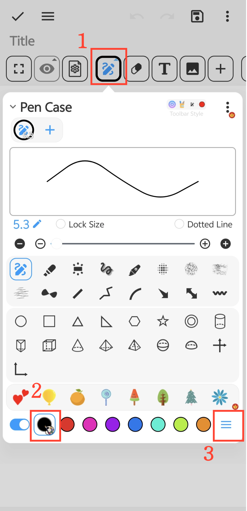

[User Manual](/drawnote/manual/en) > [Super Note](/drawnote/manual/en/super_note) >

## Color Palette & Custom Colors

#### Steps

1. On the Super Note page, tap the “Pen Case” button.

2. Tap the “Palette” button at the bottom to select or customize colors.

#### Tip

Tap “More” on the right side of the palette list to customize and combine palettes to create your own color scheme.
