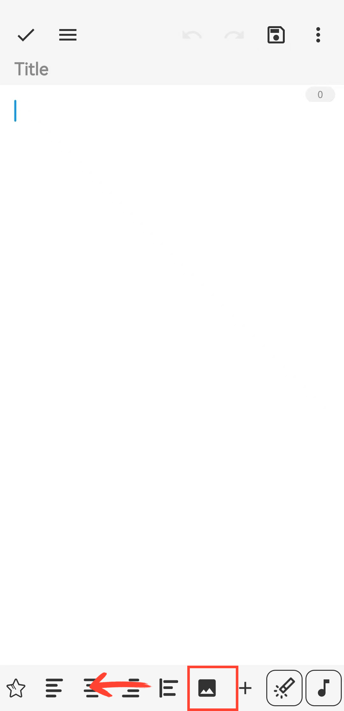

[User Manual](/drawnote/manual/en) > [Text Note](/drawnote/manual/en/text_note) >

## Insert picture

#### Steps

Swipe left on the toolbar at the bottom of the canvas, find and tap the “Image” button, then select an image to insert.

