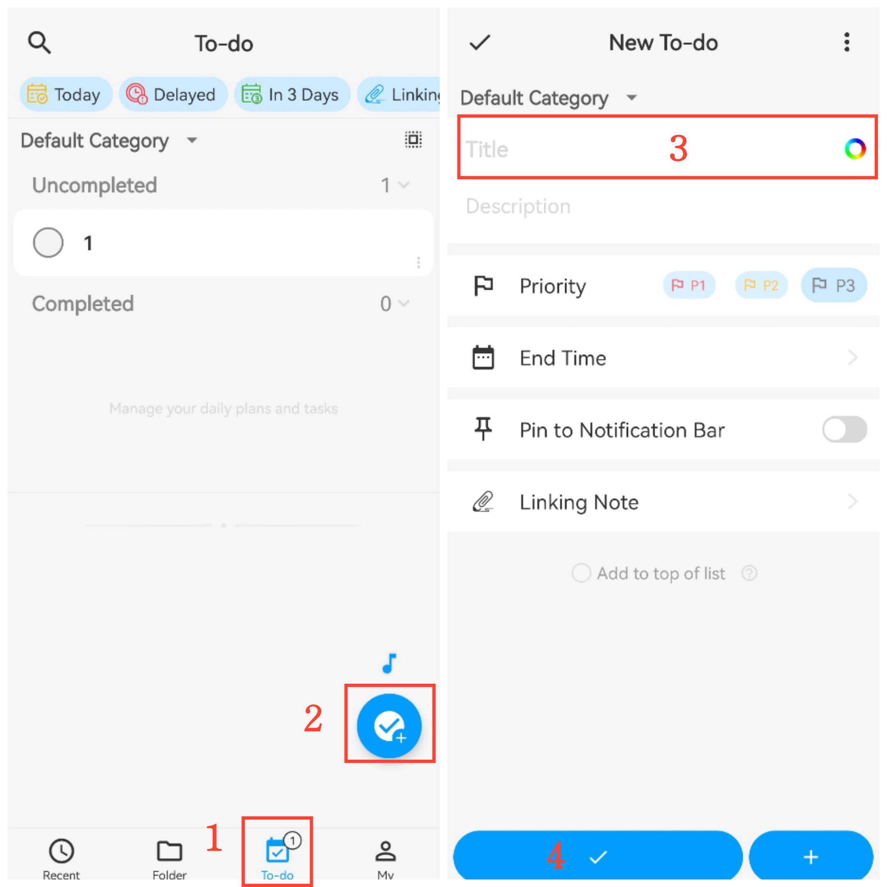
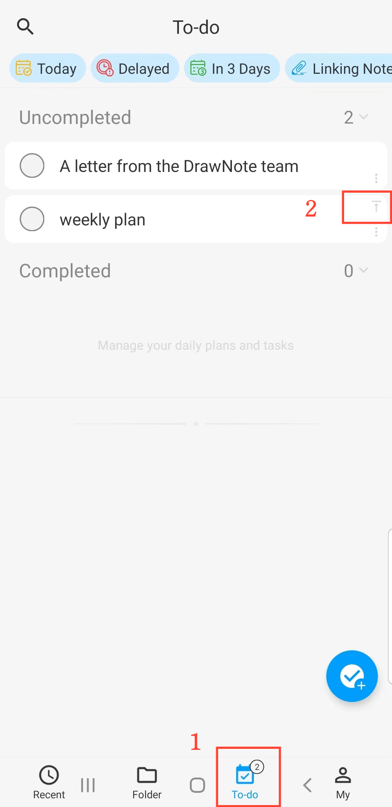

[User Manual](/drawnote/manual/en) > [To-Do List](/drawnote/manual/en/to_do) >

## New To-Do Item

#### Steps

1. Go to the "To-Do" page;

2. Tap the "+" button in the bottom-right corner;

3. Enter the title, description, and other details;

4. Tap "Confirm" to complete creation.

#### Tips

1. Item count: The bottom tab bar shows the number of pending items.

2. Pin item: In the list, tap "Pin" at the top-right corner of an item to move it to the top.

