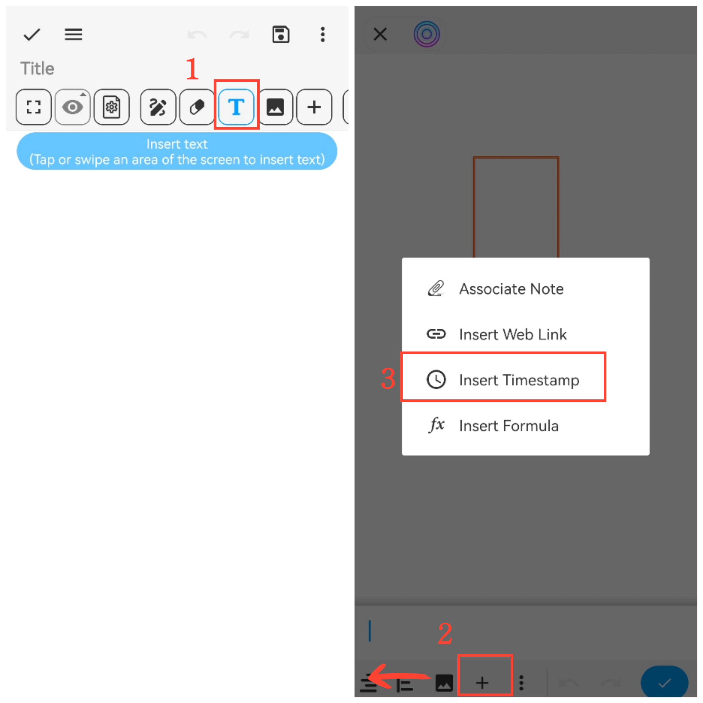

[Manual del Usuario](/drawnote/manual/es) > [Super Nota](/drawnote/manual/es/super_note) >

## Insertar marca de tiempo

#### Pasos

1. Toque el botón de **texto “T”** en la barra de menú para acceder al menú de texto.

2. Deslice hacia la izquierda en la barra de menú inferior y toque **“+”**.

3. Seleccione **“Insertar marca de tiempo”** y luego toque **“Confirmar”** para insertarla.

