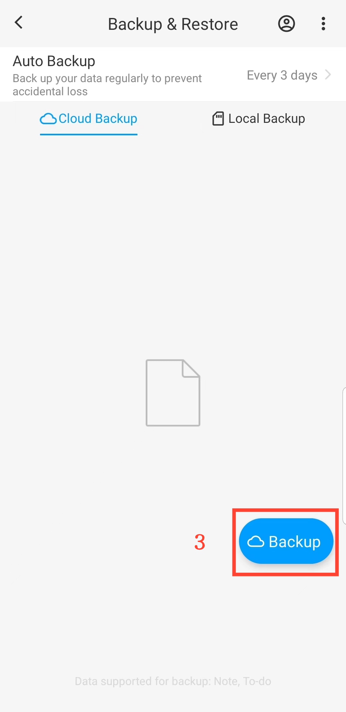

[Manuel de l'utilisateur](/drawnote/manual/fr) > [Sauvegarde et restauration des données](/drawnote/manual/fr/data_backup_and_recovery) >

Sauvegarde des données
---
#### Étapes

1. Appuyez sur "Moi" sur la page principale.

2. Accédez à l'option "Sauvegarde & Restauration".

3. Cliquez sur "Sauvegarde" pour lancer une sauvegarde immédiate.

