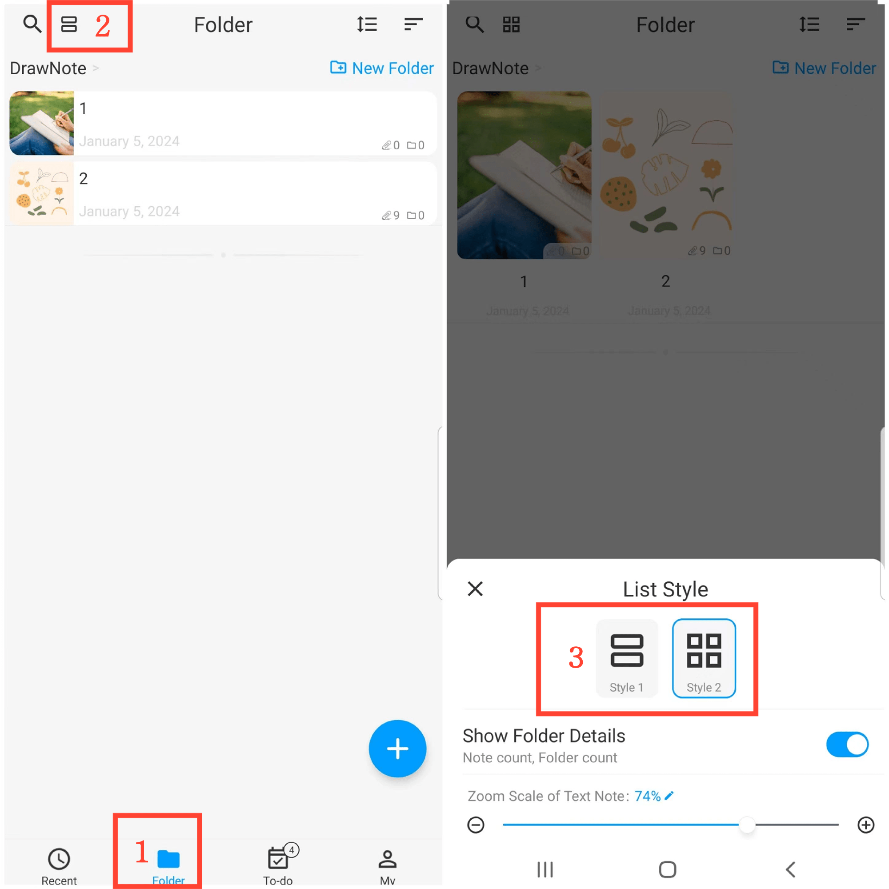

[Manuel de l'utilisateur](/drawnote/manual/fr) > [Dossier](/drawnote/manual/fr/folder) >

Style de liste
---
#### Étapes d'utilisation

1. Appuyez sur "Dossier" sur la page principale.
2. Appuyez sur le bouton "Style de liste" dans le coin supérieur gauche.
3. Choisissez un style.

