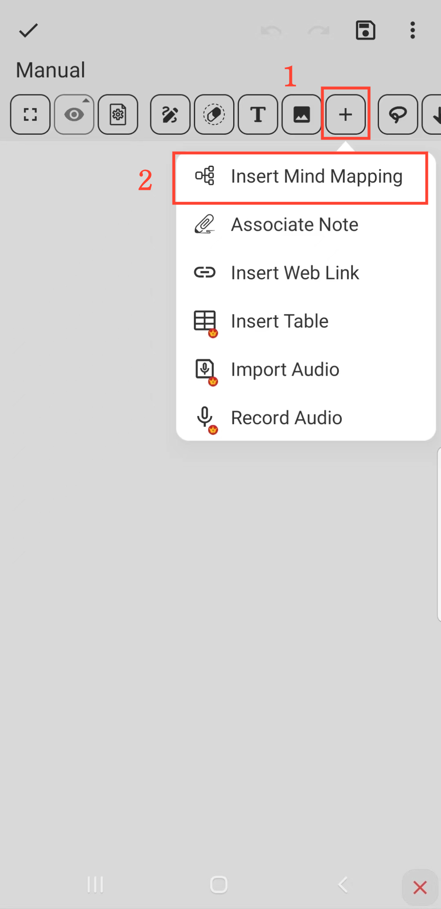

[Manuel de l'utilisateur](/drawnote/manual/fr) > [Super Note](/drawnote/manual/fr/super_note) >

Insérer une Carte Mentale
---
#### Étapes

1. Cliquez sur le bouton "+" dans la barre d'outils.

2. Choisissez "Insérer une Carte Mentale" pour ajouter la carte mentale à vos notes.

