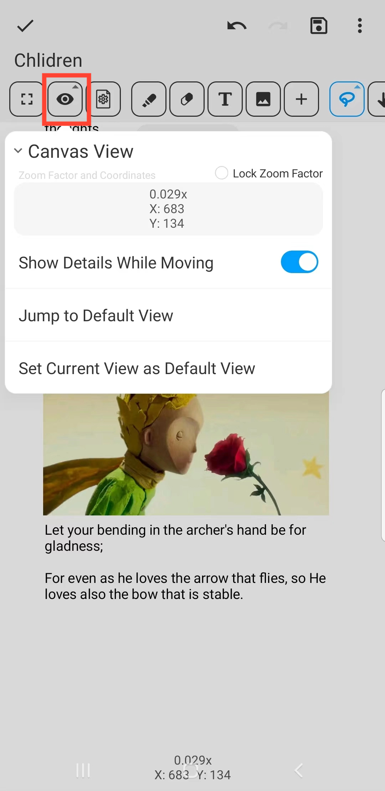

[Manuel de l'utilisateur](/drawnote/manual/fr) > [Super Note](/drawnote/manual/fr/super_note) >

vue de la toile
---
La vue du canevas est l'interface pour visualiser et éditer les notes, contenant des informations de coordonnées et de zoom.

- Pour faciliter la navigation sur des pages larges ou riches en contenu, vous pouvez définir une vue par défaut.

- Cliquez sur le bouton "Aller à la Vue par Défaut" pour revenir rapidement à la position de votre vue par défaut définie.

#### Verrouiller le facteur de Zoom
Après avoir coché "Verrouiller le facteur de Zoom", le canevas conservera son niveau de zoom actuel, empêchant le zoom basé sur les gestes.