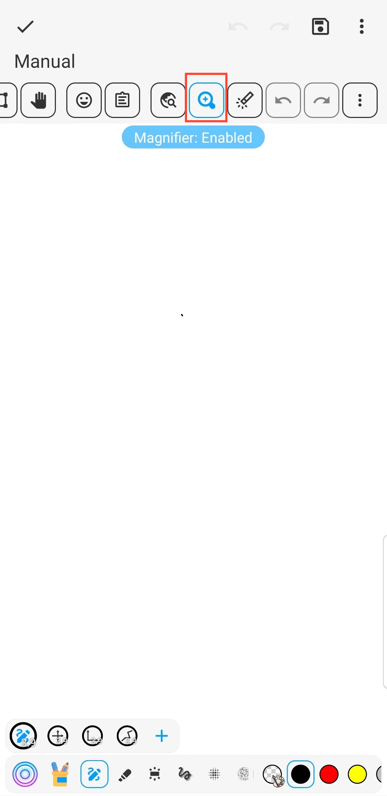

[Manuale utente](/drawnote/manual/it) > [Super Nota](/drawnote/manual/it/super_note) >

Lente d'ingrandimento
---
La funzione della lente d'ingrandimento può aiutarti a visualizzare e modificare i contenuti delle note in modo più conveniente. Specialmente quando si lavora con caratteri piccoli o grafici dettagliati. Può ingrandire testo e immagini e fornire un posizionamento preciso e un'operazione conveniente.
#### Passaggi

Sulla pagina delle Super Nota, fare clic sul pulsante della lente d'ingrandimento nella barra degli strumenti.

