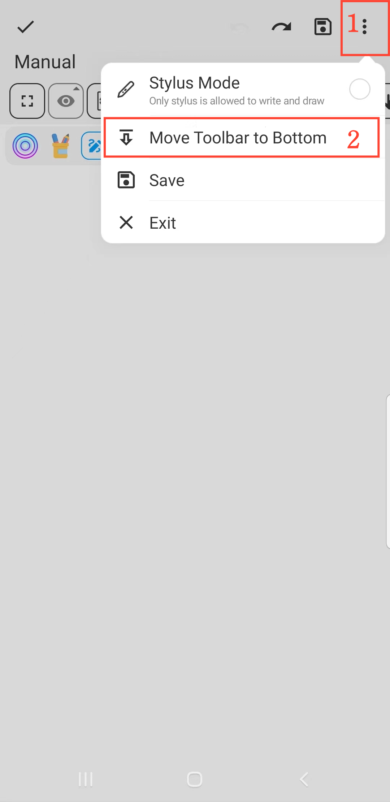

[Manuale Utente](/drawnote/manual/it) > [Super Nota](/drawnote/manual/it/super_note) >

Spostare la Barra degli Strumenti
---
#### Passaggi

1. Fare clic sul pulsante "⋮" nell'angolo in alto a destra della tela.

2. Scegliere la posizione della barra degli strumenti: "Sposta la barra degli strumenti in Basso" o "Sposta la barra degli strumenti in Alto".

