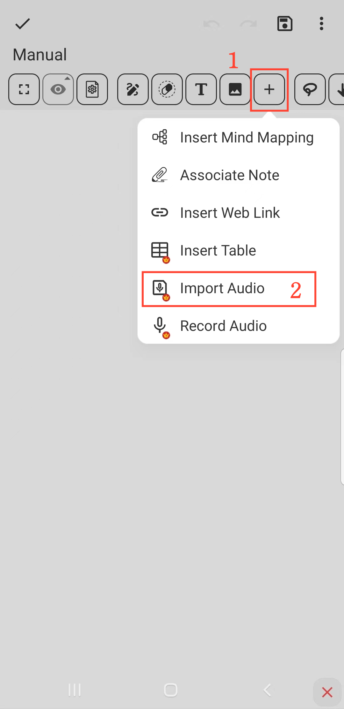

[Manual do Usuário](/drawnote/manual/pt) > [Super Nota](/drawnote/manual/pt/super_note) >

Importar Áudio
---
#### Passos

1. Clique no botão "+" na barra de ferramentas.

2. Escolha a opção "Importar Áudio". Selecione o arquivo de áudio que deseja importar e pronto.

