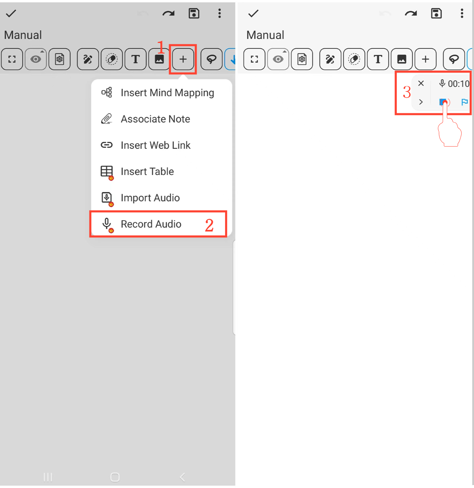

[Manual do Usuário](/drawnote/manual/pt) > [Super Nota](/drawnote/manual/pt/super_note) >

Gravar Áudio
---
#### Passos

1. Clique no botão "+" na barra de ferramentas.

2. Selecione a opção "Gravar Áudio" para iniciar a gravação de áudio.

3. Clique no botão "Parar" para finalizar a gravação.

