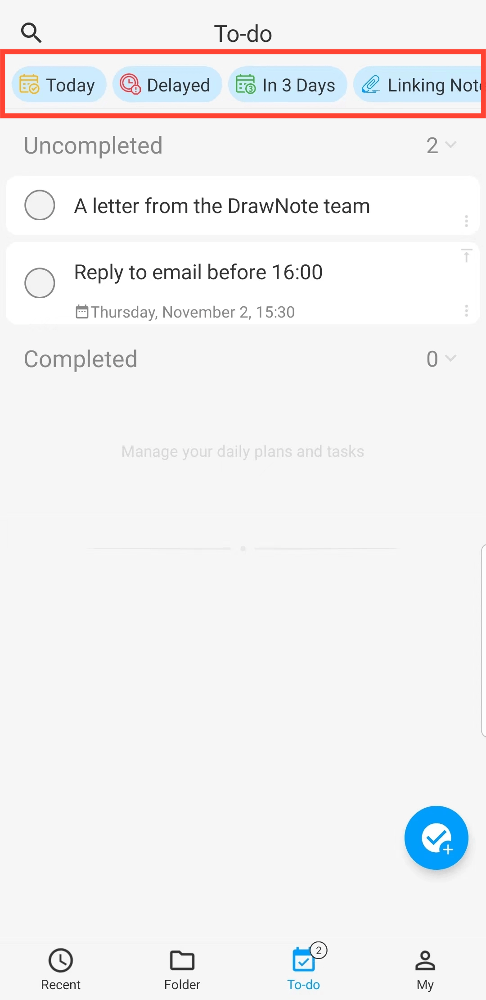

[Manual do Usuário](/drawnote/manual/pt) > [Tarefas](/drawnote/manual/pt/to_do) >

Filtro de Tarefas
---
Na página "Itens da Lista de Tarefas", você pode filtrar tarefas com base no tempo, prioridade e notas associadas.

