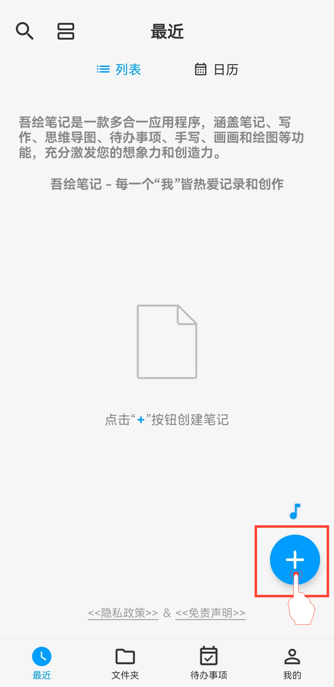
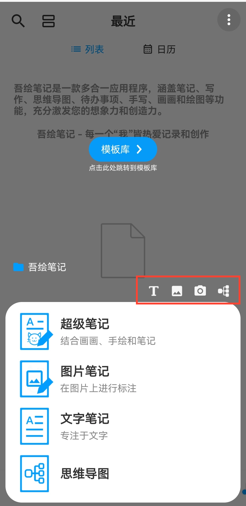

[用户手册](/drawnote/manual/zh) > 

新建笔记
---

吾绘笔记为您提供多种笔记类型，让创作和记录更自由、更高效:

- 超级笔记 -集手写、绘图、文字、图片、录音、表格与思维导图于一体，画布无限延展，尽情表达创意与灵感。

- 图片笔记 -以图片为背景，在图片上自由标注、绘画或添加文字，让每一张图片都成为您的创作画布。

- 文字笔记 -专注文字记录，支持富文本与图片插入，让内容更生动、多样化。

- 思维导图 -清晰展示思路与知识结构，快速整理复杂信息，理顺思考脉络。

#### 操作步骤

在应用首页，点击右下角的“+”图标，选择要创建的笔记类型，开始创作。

#### 提示

- 在「文件夹」处点击“+”按钮新建笔记时，新笔记将自动分类至当前文件夹。

- 您还可以利用菜单顶部的快捷入口，快速进入超级笔记的不同功能创作界面。

